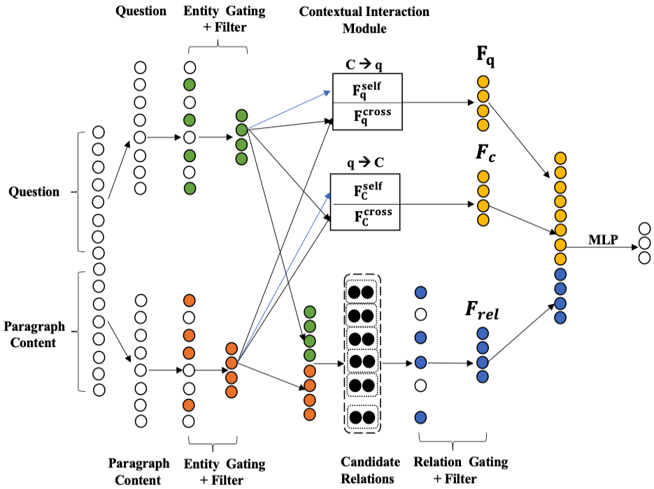
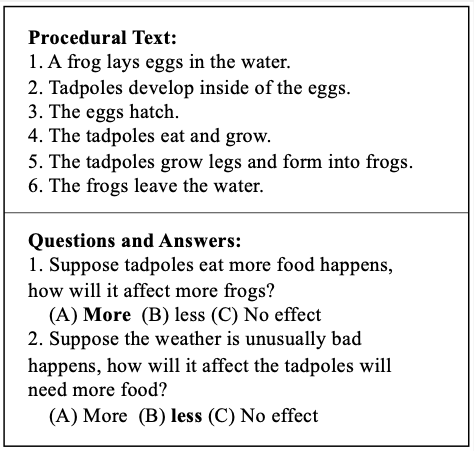

# RGN (IJCAI 2021)
The source code of IJCAI 2021 paper: Relational Gating for ``What If'' Reasoning.

## The examples of WQIA 

## Download the parameters to the RGN_model folder
link:
https://drive.google.com/file/d/1xT_h5Fe2Uf0KXOgGGZce558RV6Emy9eO/view?usp=sharing

## Conda environment

To run our code, we suggest people create the same conda environment as our experiment environment.
The following commands are shown as follows:

>- conda env create -f rgn.yaml
>- source activate rgn

## How to test RGN model:

After you download the RGN model parameter into the RGN_model folder and install the conda environment,
you can use our saved parameter file to run our test script. The test data is test V2 on the WIQA dataset.
The code uses RoBERTa-base as the pre-trained language model to run the test code.
If you can run the code successfully, the test accuracy ranges from 79.5% to 79.9%.
The process is shown as follows:

>- cd RGN_model
>- tar zxvf RGN_ckpt.tar.gz
>- mv RGN_ckpt saved_model
>- sh run_test.sh

## How to train RGN model:

Here we provide an example to train the model. More details are shown in the run_train.sh script.

>- cd RGN_model
>- sh run_train.sh

## Machine Environment and Training Time

- Machine Environment: 2 TITAN RTX
- Training time: 1 hr 30 mins
